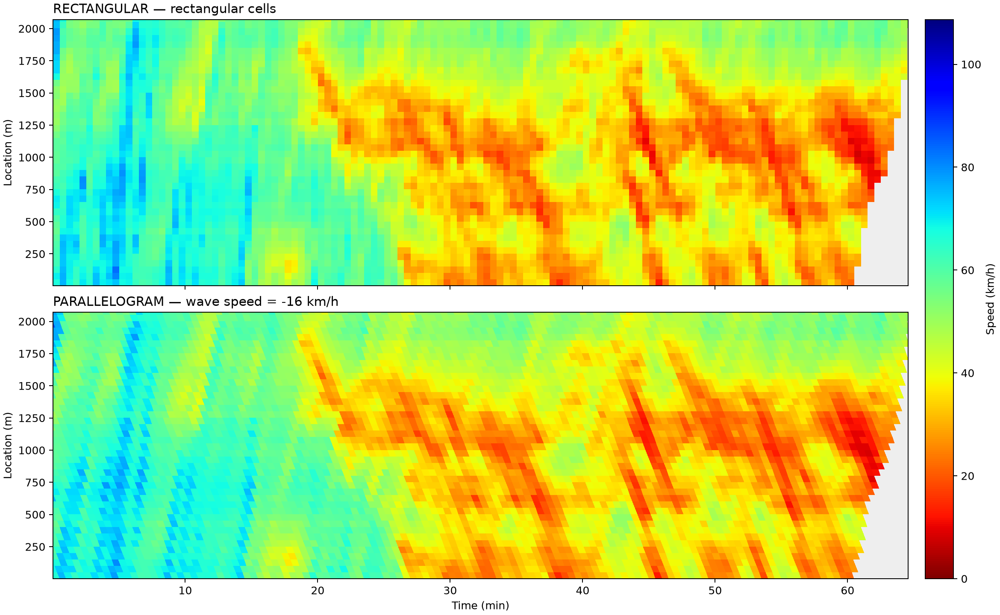

# Parallelogram Time–Space Speed Diagrams

Construct spatiotemporal speed contour diagrams from traffic observations using **rectangular (RP)** or **wave-aligned parallelogram (nRP)** cells. Both modes share the same aggregation algorithm and require only time, location, and speed. **Vehicle IDs are ignored.**

Based on the method proposed by [He et al. (2019)](#reference), this Python implementation provides a command-line interface, a Python API, optional empty-cell filling, and exports for plotting and further analysis.

## Demo



**Top:** rectangular cells. **Bottom:** parallelogram cells aligned with a backward-moving wave. Both panels use the same color scale: **red indicates low speed; blue indicates high speed** (`jet_r`).

The demo uses **254,534 observations from ZenTrafficData `TRJ_11/Lane1/F001.csv`**, a 30 s cell width, a 50 m cell height, and a wave speed of **−16 km/h**. Empty-cell filling is disabled. The wave speed is a configurable default, not an estimate calibrated to this dataset.

All five Lane 1 files are processed separately. Results are preserved in the repository, including PNG/SVG figures, cell statistics in CSV format, and metadata:

| Input file | Comparison | Complete results |
| --- | --- | --- |
| F001 | [View image](docs/results/trj11_lane1/F001/comparison.png) | [Figures, CSVs, metadata](docs/results/trj11_lane1/F001/) |
| F002 | [View image](docs/results/trj11_lane1/F002/comparison.png) | [Figures, CSVs, metadata](docs/results/trj11_lane1/F002/) |
| F003 | [View image](docs/results/trj11_lane1/F003/comparison.png) | [Figures, CSVs, metadata](docs/results/trj11_lane1/F003/) |
| F004 | [View image](docs/results/trj11_lane1/F004/comparison.png) | [Figures, CSVs, metadata](docs/results/trj11_lane1/F004/) |
| F005 | [View image](docs/results/trj11_lane1/F005/comparison.png) | [Figures, CSVs, metadata](docs/results/trj11_lane1/F005/) |

[Quick start](#quick-start) · [Input format](#input-format) · [Options](#command-line-options) · [Method](#how-it-works) · [Reference](#reference)

## Quick start

Requires **Python 3.9+**, NumPy, and Matplotlib. From the repository root, install the package and reproduce the ZenTrafficData demo:

```bash
git clone https://github.com/gotrafficgo/construct_time_space_diagram.git
cd construct_time_space_diagram
python -m pip install -e .
python -m zipfile -e data/ZenTrafficData/TRJ_11.zip data/ZenTrafficData
tx-diagram data/ZenTrafficData/TRJ_11/Lane1/F001.csv --output outputs/trj11_lane1_f001
```

Open `outputs/trj11_lane1_f001/comparison.png` to see the result. The source ZIP is included; extracted CSV files are ignored by Git and can be removed after generating the results.

To process your own observations:

```bash
tx-diagram path/to/input.csv --output outputs/my_diagram
```

The default settings are:

| Setting | Default |
| --- | --- |
| Grid mode | Both rectangular and parallelogram |
| Cell time width | 30 s |
| Cell spatial height | 50 m |
| Wave speed | **−16 km/h** |
| Colormap | **`jet_r`** (reversed jet) |
| Empty-cell filling | Disabled; missing values appear gray |

After installation, `python -m parallelogram_tx_diagram` is equivalent to `tx-diagram`.

## Input format

The input must be a **CSV file with exactly four columns in the following order**. Each row represents one trajectory data point or speed observation.

| Column | Name | Unit | Description |
| --- | --- | --- | --- |
| 1 | Vehicle ID | — | Vehicle identifier. **Ignored by this method**; may be any string or empty. |
| 2 | Time | s | Timestamp in seconds. |
| 3 | Location | m | Position along the road in meters. |
| 4 | Speed | km/h | Vehicle speed. |

Example:

```csv
VehID,Time,Position,Speed
1,1,26.25,50.82
1,2,40.42,51.05
2,2,12.80,46.30
```

Columns are read **by position**, so `Position` and `Location` are both valid names for the third column. A header is optional; when present, its second field must be `Time` or `Timestamp` (case-insensitive).

- Time, location, and speed must be finite numbers. Negative speeds are rejected; zero speed is valid.
- Rows need not be sorted or grouped by vehicle.
- Every observation has equal weight. Mixing sampling frequencies can therefore affect the mean; the tool does not resample individual vehicles.
- Use a consistent road coordinate system. If location increases in the driving direction, upstream-moving waves have negative speed.

### ZenTrafficData example

Datasets are included as ZIP archives in `data/`. Extract the archive before passing a CSV to the program (ZIP input is not read directly):

```bash
python -m zipfile -e data/ZenTrafficData/TRJ_11.zip data/ZenTrafficData
```

Then run:

```bash
tx-diagram data/ZenTrafficData/TRJ_11/Lane1/F001.csv \
  --dt 30 --dx 50 --wave-speed -16 \
  --output outputs/trj11_lane1_f001
```

Process lanes and files separately unless their relationship is known. The `TRJ_4` and `TRJ_11` files `F001`–`F005` have overlapping time ranges and should not automatically be concatenated as consecutive periods. Git includes ZIP archives under `data/` but ignores extracted files. The local paper PDF in `paper/` is also ignored.

Available archives:

| Dataset | Archives |
| --- | --- |
| ZenTrafficData | [TRJ_4.zip](data/ZenTrafficData/TRJ_4.zip), [TRJ_11.zip](data/ZenTrafficData/TRJ_11.zip) |
| NGSIM | [I80.zip](data/NGSIM/I80.zip), [US101.zip](data/NGSIM/US101.zip) |
| Cellular automaton simulation | [Seed_0.zip](data/Simulation_CA/Seed_0.zip) |

## Command-line options

| Option | Default | Description |
| --- | --- | --- |
| `--mode` | `both` | `rectangular`, `parallelogram`, or `both`. |
| `--dt` | `30` | Positive cell time width in seconds. |
| `--dx` | `50` | Positive cell spatial height in meters. |
| `--wave-speed` | `-16` | Nonzero wave speed in km/h; used for parallelogram cells. |
| `--fill` | `none` | `none` or `neighbors`. |
| `--bounds` | Data extent | Four values: `T_MIN T_MAX X_MIN X_MAX`, in seconds and meters. |
| `--vmax` | Input maximum speed¹ | Positive color-scale upper limit in km/h; lower limit is zero. |
| `--output` | `outputs` | Output directory. Existing files with matching names are overwritten. |

¹ Uses at least 1 km/h when the input maximum is lower than 1 km/h.

```bash
# Rectangular cells only
tx-diagram input.csv --mode rectangular

# Parallelogram cells with optional neighbor filling
tx-diagram input.csv --mode parallelogram --wave-speed -16 --fill neighbors

# Compare both modes in a fixed observation window and color scale
tx-diagram input.csv --bounds 0 3600 0 1750 --vmax 110 --output outputs/comparison
```

Run `tx-diagram --help` for the full command-line help.

## Output files

| File | Contents |
| --- | --- |
| `comparison.png` | Speed diagram, or a two-panel comparison when using `--mode both`. |
| `comparison.svg` | The same figure with vector text and axes; the colored mesh is rasterized to keep file size manageable. |
| `rectangular.csv` | Rectangular cell statistics and geometry, when selected. |
| `parallelogram.csv` | Parallelogram cell statistics and geometry, when selected. |
| `metadata.json` | Input path, parameters, bounds, sample counts, and empty-cell/fill statistics. |

Figures display **time in minutes**, **location in meters**, and **speed in km/h**. Both panels share the same color scale. Cell CSV files retain time in **seconds** and contain:

- Grid indices and cell center coordinates.
- Mean speed, sample count, and a `filled` flag (`1` for an interpolated cell, otherwise `0`).
- Four time coordinates and two spatial coordinates defining the cell vertices.

Missing speeds are exported as empty fields. Filled cells retain a sample count of zero. Edge-cell vertices and centers describe the original cells and can extend beyond the displayed time window.

## How it works

Let `c` be the wave speed in m/s and define a shear parameter `a` in s/m:

```text
Parallelogram: a = 1 / c, where c = wave_speed_kmh / 3.6
Rectangular:   a = 0
```

Using the lower observation bounds `(t0, x0)` as the grid origin, transform each observation:

```text
tau = (t - t0) - a * (x - x0)
i = floor(tau / dt)
j = floor((x - x0) / dx)
```

Observations are grouped into rectangular cells in `(tau, x)` coordinates. Each cell receives the **arithmetic mean of its speed samples**. For plotting, cell corners are mapped back using:

```text
t = t0 + tau + a * (x - x0)
```

This produces horizontal top/bottom edges and side edges with slope `dx/dt = c`. Setting **`a = 0`** makes those side edges vertical and gives ordinary rectangular cells. Rectangles are therefore a special case of the same algorithm; **setting wave speed to zero does not produce rectangles**.

The last spatial band is clipped to the upper spatial bound; the plot clips cell polygons to the time window. Interior boundary points belong to the following cell, while observations on the outer upper bounds are retained. Changing the observation bounds also changes the grid origin.

### Optional empty-cell filling

`--fill neighbors` implements the eight-neighbor averaging approach described in Section 2.5 of the paper. It prioritizes empty cells with the fewest missing neighbors and at least one known neighbor. Cells at the same priority are filled simultaneously, then priorities are recalculated.

Cells outside the observation window do not participate. Original observed means remain unchanged, and cells unreachable from known values remain missing. Filling large missing regions does not create new observational evidence.

### Scope

The default **−16 km/h** wave speed follows the paper's US-101 experiment; it has **not been calibrated for ZenTrafficData**. Set `--wave-speed` to an appropriate value for your observations.

This project implements cell construction, sample-speed aggregation, and optional neighbor filling. It does not reproduce the paper's probe-vehicle sampling, travel-time evaluation, or full experimental study. Parallelogram cells are not guaranteed to outperform rectangles in every traffic condition.

## Python API

```python
from parallelogram_tx_diagram import read_csv, aggregate, fill_empty

# Returns an (N, 3) array: time (s), location (m), speed (km/h).
points = read_csv("input.csv")

rectangular = aggregate(points, dt=30, dx=50, wave_speed_kmh=None)
parallelogram = aggregate(points, dt=30, dx=50, wave_speed_kmh=-16)

# Returns a new grid; the original observations are preserved.
filled = fill_empty(parallelogram)

mean_speeds = parallelogram.speed
sample_counts = parallelogram.count
time_vertices, location_vertices = parallelogram.vertices()
```

## Development

Run the tests after installation:

```bash
python -m unittest discover -s tests -v
```

Tests cover hand-calculated rectangular means, wave-aligned geometry, direct geometric membership, boundary-point conservation, independence from vehicle IDs, and preservation of observed values during filling.

The real-data demo results are stored in `docs/results/trj11_lane1/`, so GitHub displays them even though temporary `outputs/` files and extracted datasets are ignored. To refresh one of the published results after extracting the archive:

```bash
tx-diagram data/ZenTrafficData/TRJ_11/Lane1/F001.csv --output docs/results/trj11_lane1/F001
```

An optional synthetic-data generator remains available for development:

```bash
python examples/generate_demo.py
tx-diagram outputs/demo/input.csv --output outputs/demo/result
```

## Reference

He, Z., Lv, Y., Lu, L., & Guan, W. (2019). **Constructing spatiotemporal speed contour diagrams: using rectangular or non-rectangular parallelogram cells?** *Transportmetrica B: Transport Dynamics*, **7**(1), 44–60. [https://doi.org/10.1080/21680566.2017.1320774](https://doi.org/10.1080/21680566.2017.1320774)

If you use this method in research, please cite the paper:

```bibtex
@article{he2019constructing,
  author  = {He, Zhengbing and Lv, Ying and Lu, Lili and Guan, Wei},
  title   = {Constructing spatiotemporal speed contour diagrams: using rectangular or non-rectangular parallelogram cells?},
  journal = {Transportmetrica B: Transport Dynamics},
  year    = {2019},
  volume  = {7},
  number  = {1},
  pages   = {44--60},
  doi     = {10.1080/21680566.2017.1320774}
}
```

## License

The project code is released under the [MIT License](LICENSE).
Third-party datasets retain their original licenses and terms; the MIT license
for this software does not relicense those datasets or the referenced paper.
